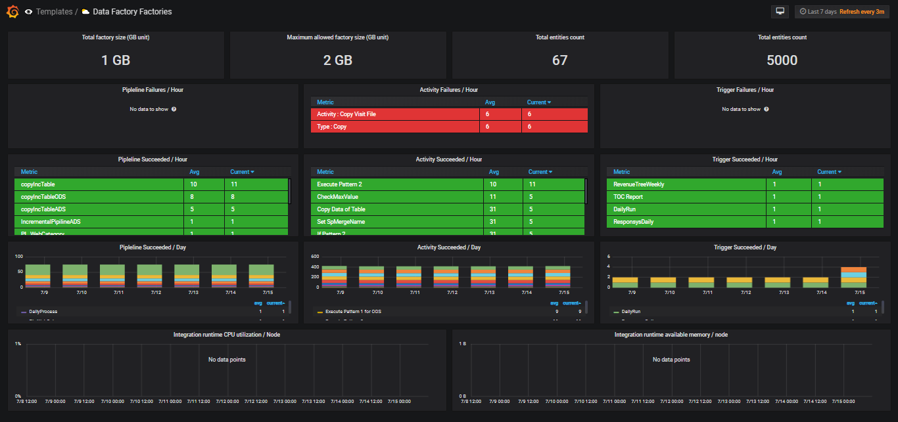
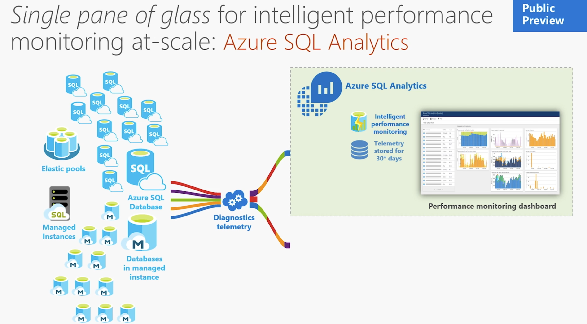
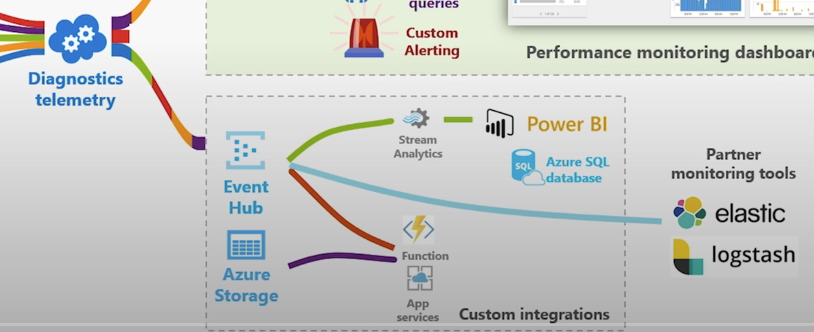
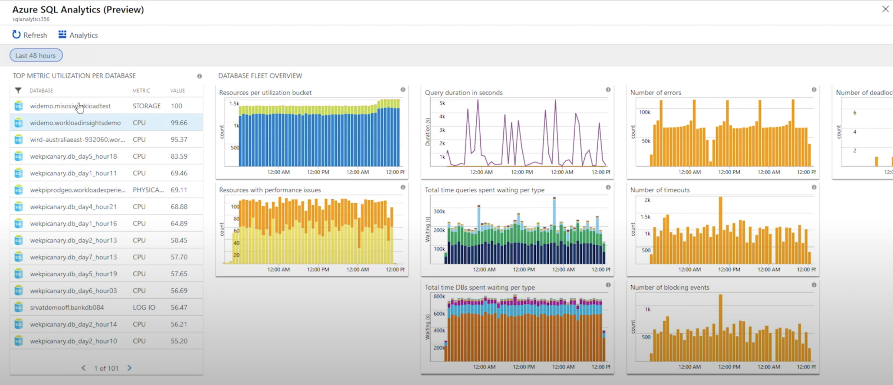
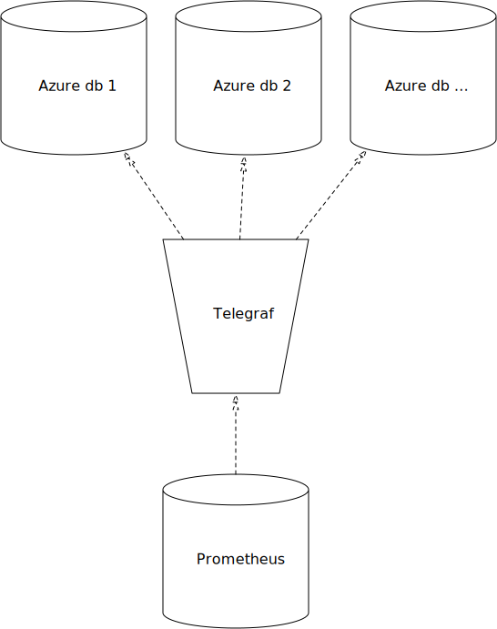
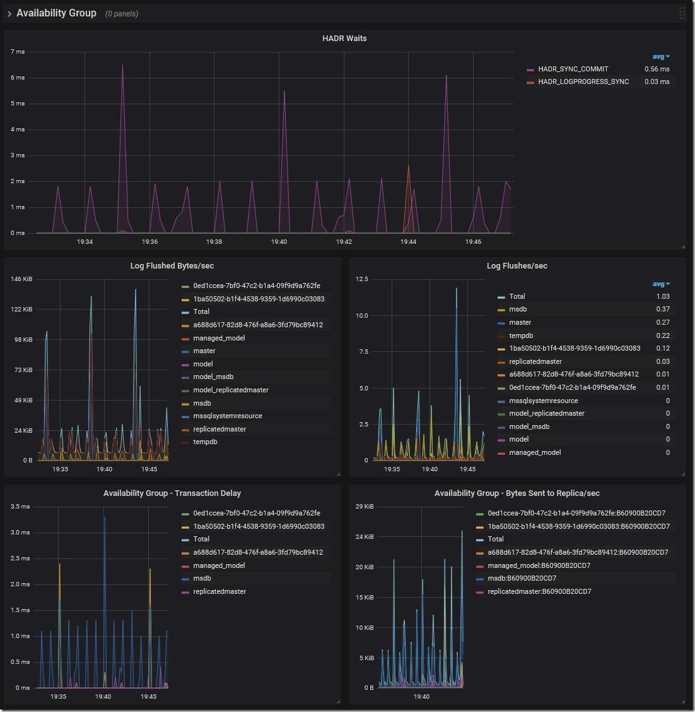
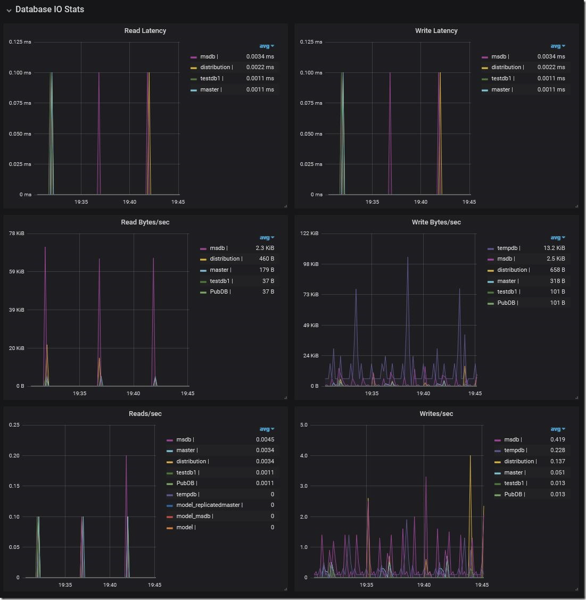
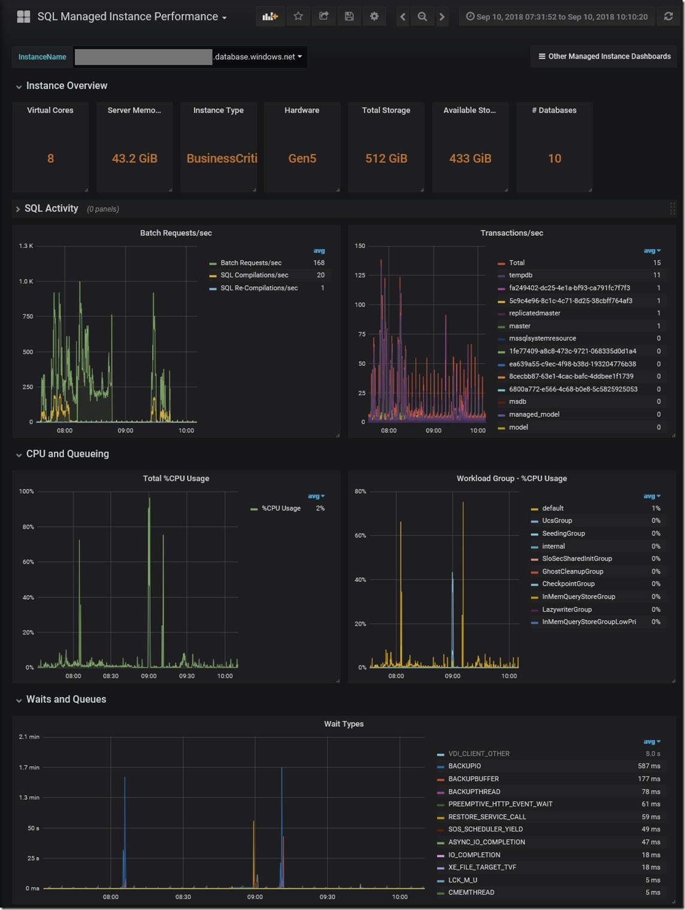

- Meeting with [[FrankDePeppo]]
	- ->Discussed monitoring more systems and using some extra metrics I found
	- DONE Investigate monitoring more components
	  done:: 1628581271495
	  now:: 1628568650918
	  later:: 1628019876232
	  Completed [[Aug 10th, 2021]]
		- ADF - azure data factory
			- [[Azure Data Factory API]]
				-
				-
			- Sample dashboard
				- {:height 294, :width 609}
		- SQL DB -> Microsoft Azure SQL
			- Links:
				- [denzilribeiro/sqldbmonitoring: Azure SQL DB monitoring](https://github.com/denzilribeiro/sqldbmonitoring)
				- [Real-time performance monitoring for Azure SQL Database Managed Instance - Microsoft Tech Community](https://techcommunity.microsoft.com/t5/datacat/real-time-performance-monitoring-for-azure-sql-database-managed/ba-p/305537)
				- [Azure SQL Analytics solution in Azure Monitor - Azure Monitor | Microsoft Docs](https://docs.microsoft.com/en-us/azure/azure-monitor/insights/azure-sql)
			- Questions:
				- Are you using managed instances?
			- To monitor the performance of a database in Azure SQL Database and Azure SQL Managed Instance, ==start by monitoring the CPU and IO resources used by your workload relative to the level of database performance you chose in selecting a particular service tier and performance level==. To accomplish this, Azure SQL Database and Azure SQL Managed Instance emit resource metrics that can be viewed in the Azure portal or by using one of these SQL Server management tools: Azure Data Studio or SQL Server Management Studio (SSMS).
			- Azure SQL Analytics is an advanced cloud monitoring solution for monitoring performance of all of your databases at scale and across multiple subscriptions in a single view. For a list of the logs and metrics that you can export, see==[diagnostic telemetry for export](https://docs.microsoft.com/en-us/azure/azure-sql/database/metrics-diagnostic-telemetry-logging-streaming-export-configure#diagnostic-telemetry-for-export)==
			- Azure SQL Analytics
			  collapsed:: true
				- 
				- 
				- {:height 293, :width 662}
				-
			- Monitoring with telegraf
				- Configuration
				  collapsed:: true
					- #### Create Logins for each Managed Instance or SQL DB being monitored
					  
					  **Note:** Please ENSURE that you replace the sample passwords given below with a truly strong password, before executing the same.
					  
					  For Managed Instance:
					  
					  ```
					  USE master;
					  CREATE LOGIN telegraf WITH PASSWORD = N'StrongPassword1!', CHECK_POLICY = ON;
					  GO
					  GRANT VIEW SERVER STATE TO telegraf;
					  GO
					  GRANT VIEW ANY DEFINITION TO telegraf;
					  GO
					  ```
					  
					  For SQL DB create a database scoped user for each database being monitored:
					  
					  ```
					  CREATE USER [telegraf] WITH PASSWORD = N'Mystrongpassword1!';
					  GO
					  GRANT VIEW DATABASE STATE TO [telegraf];
					  GO
					  ```
					- ##### Edit the telegraf configuration file
					  
					  Edit the `/etc/telegraf/telegraf.conf` to add one connection string per each database you want to monitor. Optionally, modify the `/etc/telegraf/telegraf.conf` with the options specified [here](https://github.com/influxdata/telegraf/tree/master/plugins/inputs/sqlserver)
					  
					  **Note:** For **Azure SQL Database**, you would need one connection string per database you are monitoring specifying the right database name and _not_ `master`. An example snippet for monitoring two databases, each on a different logical SQL server, is shown below:
					  
					  ```
					  [[inputs.sqlserver]]
					  servers = ["Server=server1.database.windows.net;Port=1433;User Id=telegraf;Password=Mystrongpassword1!;database=myazuredb1;app name=telegraf;"
					  ,"Server=server2.database.windows.net;Port=1433;User Id=telegraf;Password=Mystrongpassword1!;database=myazuredb2;app name=telegraf;"]
					  
					  query_version = 2
					  azuredb=true
					  ```
				- Architecture
				  collapsed:: true
					- 
				- Dashboards
				  collapsed:: true
					- 
					- 
					- 
		- VMs -> node exporter
		- Storage Accounts
		  collapsed:: true
			-
			  collapsed:: true
			  > There doesn't seem to be much information on monitoring without Azure monitor. Before I dig Further, which kind of storage account?
				- Blob
				- Datalake Storage
	- LATER Investigate Service discovery with Managed Identity
	  done:: 1628001405269
	  now:: 1628001404686
	  later:: 1628001406618
	- DONE [#A] Build a [[Bronze dashboard]]
	  later:: 1628057365862
	  now:: 1628317049659
	  done:: 1628487124533
	  DEADLINE: <2021-08-07 Sat>
	- LATER Investigate Log4j -> info on microbatches
	  later:: 1628000336092
- DONE Created [[Tasks]] to have an overview
  done:: 1628018412384
  later:: 1628018411153
- DONE Install [new dark theme](https://github.com/LeonWong0609/logseq-default-dark-0-saturation)
  doing:: 1628018714077
  todo:: 1628018715261
  canceled:: 1628019069465
  done:: 1628019079185
- CANCELED How do I ==highlight ==
  canceled:: 1628018545975
  id:: 61099302-015e-4521-a11e-19c92091e276
- [[Readwise book]]
- Found [Logseq - Unofficial Documentation](https://mschmidtkorth.github.io/logseq-msk-docs/#/page/Logseq%20-%20Unofficial%20Documentation)
- CANCELED [[CrushFTP Demo Dashboard]] [[JohanDeWulf]]
  done:: 1628057236517
  now:: 1628029291793
  later:: 1628029288745
  canceled:: 1628057256803
	- Request was just to collect the data
- Listened to [[Mind The Innovation Interview with Me]]
  done:: 1628079188009
  later:: 1628079186925