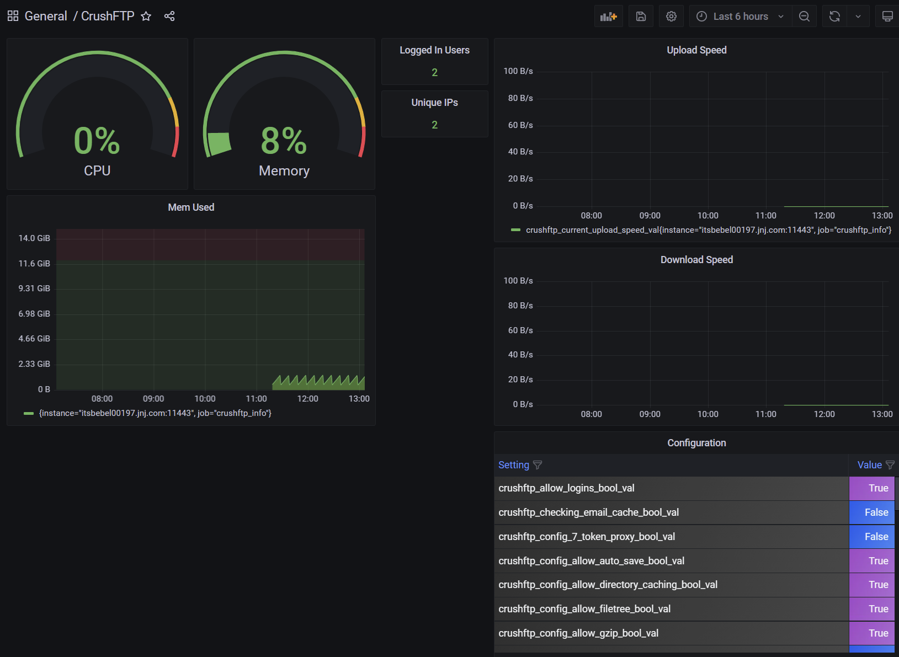

- [[Ilmars Parols]]
	-
	  > His team are GenZ  and culture is different from tele2
- [[Stefana]] [[Mattias N]]
	- DONE Book Billing fish Sync
	  done:: 1628317062128
- [[LindaAntonsson]]
	- CANCELED Call for [[Transformation JIRA]] Training
	  now:: 1628161142742
	  later:: 1628161142084
	  canceled:: 1628231288241
	  cancelled:: 1628231280584
	  id:: 610cce2a-9a7f-497e-a289-ac3f0a4b7df0
- Started clipping [[prometheus docs]]
- [[Mandu]]
	- DONE Fix issues in RDOP Server
	  later:: 1628200459557
	  now:: 1628200460414
	  id:: 610cce2a-1ef9-46e8-99ce-94c0936b84cd
	  done:: 1628245260427
		-
		  ```
		  URL: http://itsbebelsp02313.jnj.com:5500
		  User: tempdebug
		  Password: GetAccess@2021
		  ```
		- When we don't have any TSA it show as red -> RHPM
		- ~~Only [[performance test is not running for broker]]~~ -> raised feature request
		- ~~{enc} added at the begining of instance and target for WS~~
		  done:: 1628238044135
		  later:: 1628238045755
		  id:: 610cce2a-9767-41a8-8af6-2e9e166d48b5
- [[JohanDeWulf]]
	- DONE Look at data of crushftp
	- DONE Build a sample Crushftp dashboard on 409  
	  now:: 1628489307006
	  id:: 6110e2b4-5c02-4029-8390-4ef69b011301
	  done:: 1628503712109
	  DEADLINE: <2021-08-06 Fri>
		- Data was only collecting for a little While, sent email to johan [Re: \[INFO\] \[Version x.x.x Build xx\] Application telemetry via Prometheus - \[YAU-HMDCK-XAY\]](hook://email/FEDB4E60-5BA0-4509-91C4-248E59987CC3%40liberato.org)
		- Suggestions
			- config metrics should all start with crushftp_config
			- instead of prefix _val put unit (s, m, bytes, bool)
		- [[Aug 9th, 2021]]  built: 
		-