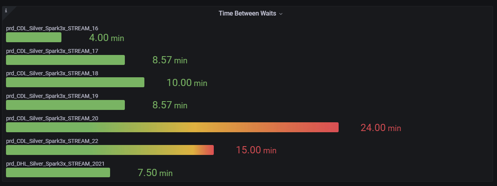

- DONE Finally managed to [[Grafana/Merge Data Between Data Sources]]
  done:: 1628326962066
  now:: 1628326961492
  later:: 1628326960599
- DONE Build better version of Time Between Waits Panel #Databricks #FrankDePeppo
  done:: 1628329171366
  collapsed:: true
	- Used [[Grafana/Merge Data Between Data Sources]] to achieve
	- 
- DONE Upgrade main dashboard with better version of time Between waits
- DONE Fix wrong counts
  now:: 1628364149212
  done:: 1628364149843
  > #FrankDePeppo [[Aug 5th, 2021]]   Hello Ricardo, when u have chance check record counts for tabls when it comes to Prod / QA for some reason when looking at 2 tables `atl_ckis` and `atl_ckit`  count from QA are shoing up in Prod