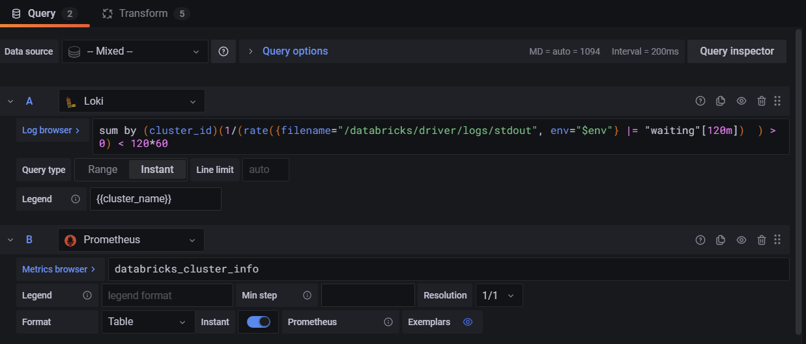
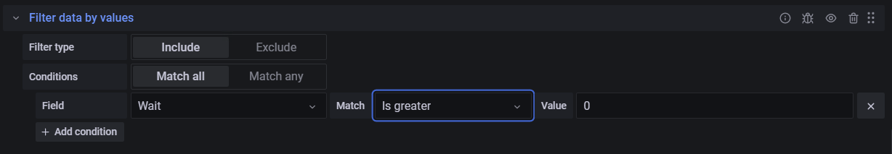
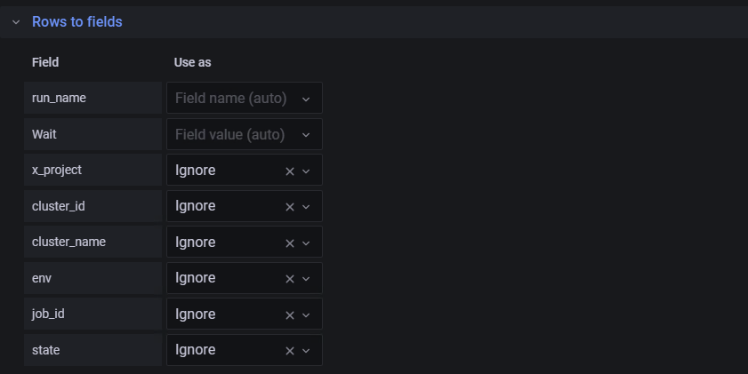

title:: Grafana/Merge Data Between Data Sources
type:: howto
tags:: #grafana

# Howto
	- In the query Use Mixed and chhose both data sources
	  > Note: This is for instant queries, not sure how performant it will be for ranges
	  > Note: Tested with Table kind of data and with Table and bar chart datasources
	- ## Create A Mixed Query
		- 
		  > Make sure to summarize by the fields you want to merge)
	- ## Filter on the data you need
	  > if you are mixing a main table with a lookup table, there usually will be more values in the lookup that query returns.
		-  
		  > For instant queries filter by not null is not working as of Grafana 8.1.0
		-
	- ## Sort
		- 
	- ## Format
		- If you want to display in a table you're ready. If in a panel that expects time series data...
		- 