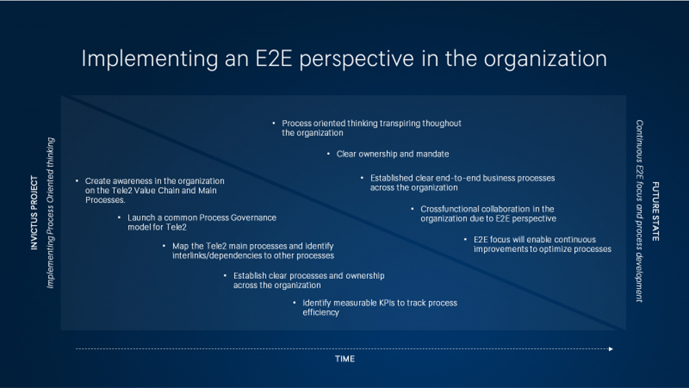
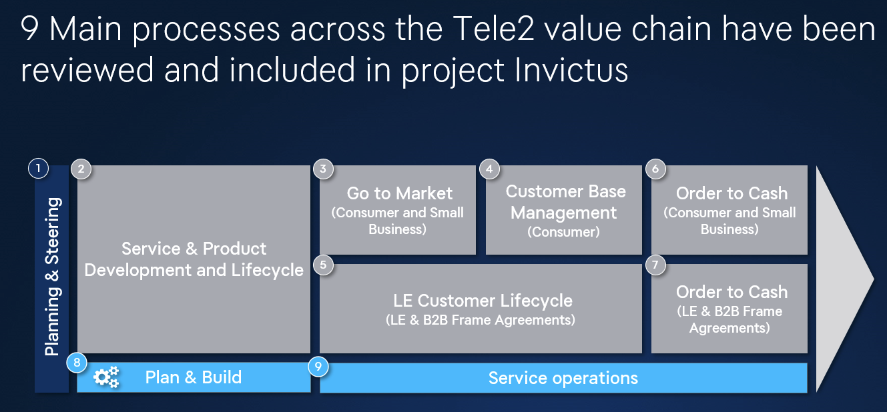
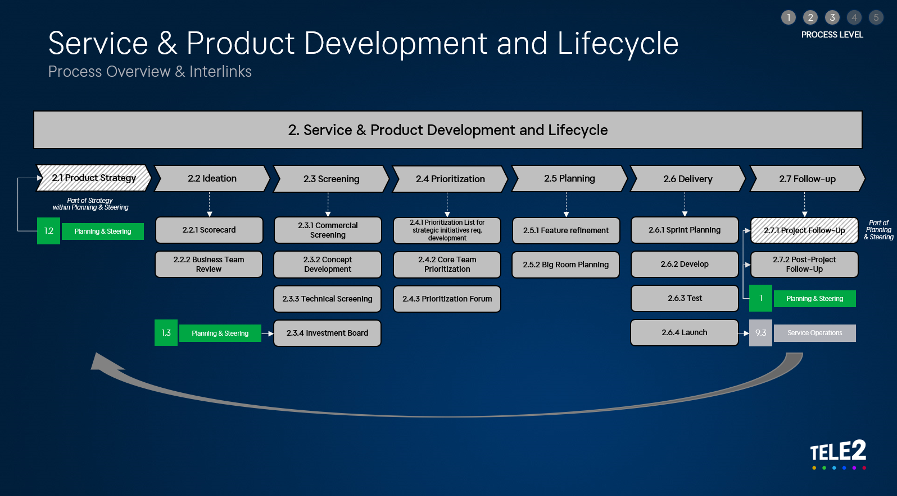
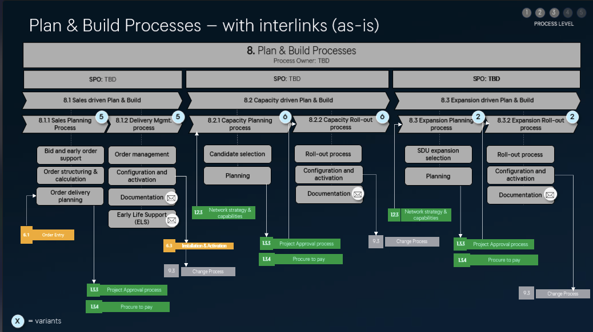
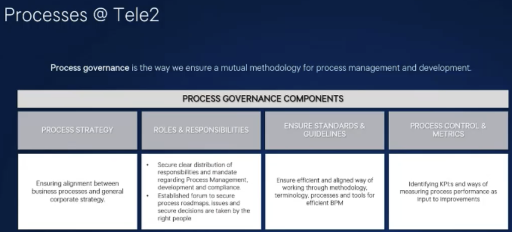
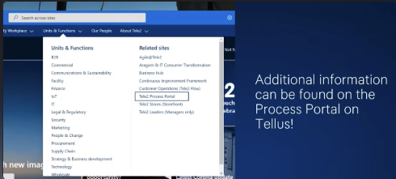

- End to end perpective on processes
- Helping everyone understand where they fit in the overall value chain
- Process portal [link](https://tele2.sharepoint.com/sites/Tele2-Process-Portal)
- {:height 217, :width 356}
- 
- 
- 
- 
- Process framework comes from
	- b2b
	- technology
	- finance
- Where to find
	- 