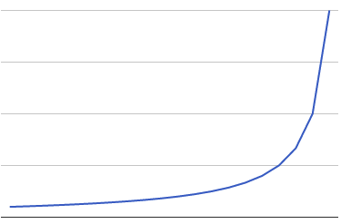

# Avoid outages: Beware the Knee

> Your service's traffic is steadily growing, latency has increased a bit but it's within reason. One day you launch a new customer and the latency jumps through the roof causing an outage. What happened? You hit the knee.

---
Your service's traffic is steadily growing, latency has increased a bit but it's within reason. One day you launch a new customer and the latency jumps through the roof causing an outage. What happened? You hit the knee.

- Utilisation increases cause exponential latency increases
  
  ==When shopping in a supermarket we're used to seeing queues suddenly appear, where just a few minutes before people were passing straight through the checkouts. The exact same happens with production services as traffic ebbs and flows==. Both these systems fall under [queuing theory](https://en.wikipedia.org/wiki/Queueing_theory), whether it be a physical queue or a kernel network buffer.
  
  Let's say that you can handle 10 requests per second one at a time, with each request taking 100ms to process. If you have on average one request per second coming in, then almost always there will be no other requests in progress and thus each request will usually only take 100ms. As the service gets busier there's a good chance that another request is being processed, so it'll need to queue up and and take 200ms sometimes. As it nears 10 requests per second, having to queue up behind several other requests is the norm and beyond that the queue will grow indefinitely!
  
  This isn't a linear growth in response time. Similar to ==the [Birthday Paradox](https://en.wikipedia.org/wiki/Birthday_problem), the more timeslots that are already taken the higher the chance that a request will bump into another request==. The graph above shows how this grows with increased utilisation. The knee is the inflection point on the right, and that's what you usually want to avoid.
  
  For a very low latency system you may choose to operate on the left of the graph, spending money on machines to improve performance. Conversely if you can accept high latency then you might elect to run past the knee, saving money but needing safety measures like graceful degradation and load shedding to avoid a complete overload.
  
  All this is just the implications of queuing theory. With a queue of requests building up other problems may arise, such as increased lock contention or the request handling part of your application being O(n2) in the number of pending requests.
  
  When doing provisioning and capacity planning, it's convenient to pretend that everything is linear. ==If you ever see a 10% increase in traffic result in much more than a 10% increase in latency though, you're approaching the knee.== Be wary in that case, as the next launch or machine failure could tip you over past the knee.