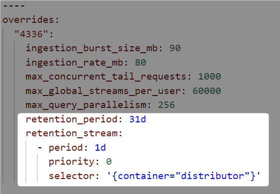
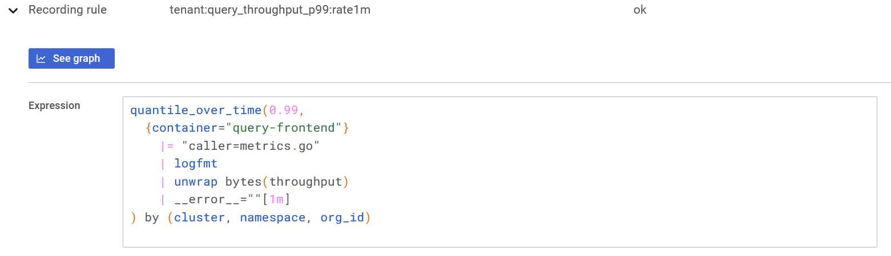

# Loki 2.3 is out: Custom retention, 15x query speed on recent data, Prometheus-style recording rules | Grafana Labs

> The latest Loki release also includes improvements to LogQL for querying logs more efficiently and easily.

---
Excellent new features have arrived in Loki v2.3.0. Bug fixes too. And performance increases on top of that. While we have been quiet, we have been very busy!
- ## Custom retention
  id:: 6110c3f2-7473-4ee8-aad6-8f5cd5536038
  
  Retention in Loki has always been global for a cluster and deferred to the underlying object store.
  
  Loki can now handle retention through the Compactor component. ==You can configure retention per tenant and per stream==. These different retention configurations allow you to control your storage cost and meet security and compliance requirements in a more granular way.
  
  Configuration is done using the existing overrides mechanism of Loki’s config:
   
  
  Read the [Loki storage retention documentation](https://grafana.com/docs/loki/latest/operations/storage/retention/#retention-configuration) for more information.
## Deletes

Loki now supports deletion of log entries for select streams within a specified time interval.

Like the custom retention feature, deletion is supported through the Compactor component. The Compactor exposes API endpoints for deletion tasks. There are endpoints for requesting a delete, for listing the existing delete requests with their status, and for canceling a pending delete request.

The initial implementation of this feature supports deleting data up to the current time - 24 hours (you cannot delete data within the last 24 hours). The primary requirement for this implementation is to make sure Loki can remain compliant with requests to delete personal information. It is possible, but more complicated, to delete data up to the current time. We will likely iterate on this functionality in the future to add such capability.

This feature is experimental and is only supported with the [BoltDB shipper index store](https://grafana.com/docs/loki/latest/operations/storage/boltdb-shipper/). You can learn more about this feature in the [Log entry deletion documentation](https://grafana.com/docs/loki/latest/operations/storage/logs-deletion/).
- ## Recording rules
  id:: 6110c3f2-ee22-49db-8304-a6faedeead34
  
  Loki now supports Prometheus-style recording rules. ==Recording rules enable you to run metric queries over your logs at regular intervals, sending the resulting metrics to [Prometheus](http://grafana.com/oss/prometheus/)== and Prometheus-compatible systems such as Cortex and Thanos.
  
  One compelling use case of recording rules is for software that cannot be instrumented to emit Prometheus metrics. **_Using only logs_, you can create metrics!**
  
  We have been playing around with creating per-tenant (org\_id) metrics from Loki’s `metrics.go` log line, which outputs a lot of individual query stats.
  
   
  
  This can also be accomplished with Prometheus and histograms, but one advantage to this approach is we don’t need to generate a histogram with a tenant label dimension, so it reduces the number of series stored in Prometheus. Only one series per tenant is generated rather than a series per each tenant times the number of buckets in the histogram. Recording rules in Prometheus can also accomplish the same reduction to one series per tenant, but there may be circumstances in which this approach would work better for you.
  
  This feature is experimental. See the [Recording rules documentation](https://grafana.com/docs/loki/latest/rules/#recording-rules) for more details.
- ## Pattern parser
  id:: 6110c3f2-6645-4573-b430-04f9bf46ef1d
  
  ==Writing LogQL queries to extract labels for unstructured logs is faster and easier with the new pattern parser==. With the pattern parser, you can avoid writing cumbersome regular expressions, especially for common log formats formed of tokens separated by literals and spaces.
  
  Consider this NGINX log line:
  
  ```
  0.191.12.2 - - [10/Jun/2021:09:14:29 +0000] "GET /api/plugins/versioncheck HTTP/1.1" 200 2 "-" "Go-http-client/2.0" "13.76.247.102, 34.120.177.193" "TLSv1.2" "US" ""
  ```
  
  This log line can be parsed with the pattern parser expression:
  
  ```
  <ip> - - <_> "<method> <uri> <_>" <status> <size> <_> "<agent>" <_>
  ```
  
  It extracts these fields:
  
  ```
  "ip" => "0.191.12.2"
  "method" => "GET"
  "uri" => "/api/plugins/versioncheck"
  "status" => "200"
  "size" => "2"
  "agent" => "Go-http-client/2.0"
  ```
  
  To learn more about the syntax, see the [LogQL documentation](https://grafana.com/docs/loki/latest/logql/#pattern).
## Ingester sharding

Sharding in Loki is a technique used by the query frontend to split queries for parallel computation. Before v2.3.0, sharding was not applied to recent data. With ingester sharding, all time ranges are parallelized.

**Sharding increases performance: Our environment jumps from ~1GB/s to ~15 GB/s search speed.** It should improve search performance for recent data queries over a large quantity of streams or streams with a large quantity of data.

As an example, look at the difference when querying the last hour of data from our NGINX ingress controllers, which are logging about 90GB an hour:

Before ingester sharding:

```
❯ logcli query '{container="ingress-nginx"} |= "trytofindme!!!"' --since=1h --stats 2>&1 | grep Summary
Summary.BytesProcessedPerSecond  784 MB
Summary.LinesProcessedPerSecond  1263304
Summary.TotalBytesProcessed      88 GB
Summary.TotalLinesProcessed      141420028
Summary.ExecTime                 1m51.944531908s
```

After ingester sharding:

```
❯ logcli query '{container="ingress-nginx"} |= "trytofindme!!!"' --since=1h --stats 2>&1 | grep Summary
Summary.BytesProcessedPerSecond  15 GB
Summary.LinesProcessedPerSecond  24171034
Summary.TotalBytesProcessed      88 GB
Summary.TotalLinesProcessed      142086646
Summary.ExecTime                 5.878385063s
```

Ingester sharding is enabled by default, but only takes effect if you have a query-frontend component running that is responsible for creating the splits and shards sent to ingesters.
## LogQL IP address matching

For anyone who would like to do more complicated filtering on logs containing IP addresses, LogQL has been taught a number of new tricks to help you out.

The syntax looks like: `ip("<pattern>")`. The <pattern> can be:
- A single IP address. Examples: ip(“192.0.2.0”), ip("::1")
- A range within the IP address. Examples: ip(“192.168.0.1-192.189.10.12”), ip(“2001:db8::1-2001:db8::8”)
- A CIDR specification. Examples: ip(“192.51.100.0/24”), ip(“2001:db8::/32”)
    
  
  This allows you to do things like:
  
  Return log lines matching a specific IP
  
  `{container="nginx"} |= ip("192.168.4.5")`
  
  Return log lines excluding a range of IPs
  
  `{container="nginx"} != ip("192.168.4.1-192.168.4.10")`
  
  Return log lines matching a specific subnet
  
  `{container="nginx"} |= ip("192.168.4.0/24")`
  
  Find out more about the syntax in the [LogQL documentation](https://grafana.com/docs/loki/latest/logql/ip).
## Learn more

Be sure to read the [Changelog](https://github.com/grafana/loki/blob/main/CHANGELOG.md#230-20210806) for all the details of this release, and the [Upgrade guide](https://grafana.com/docs/loki/latest/upgrading/) to make sure your upgrade process is smooth.

v2.3 is the first Loki release under the AGPLv3 license. You can [read more about our licensing here](https://grafana.com/licensing/).